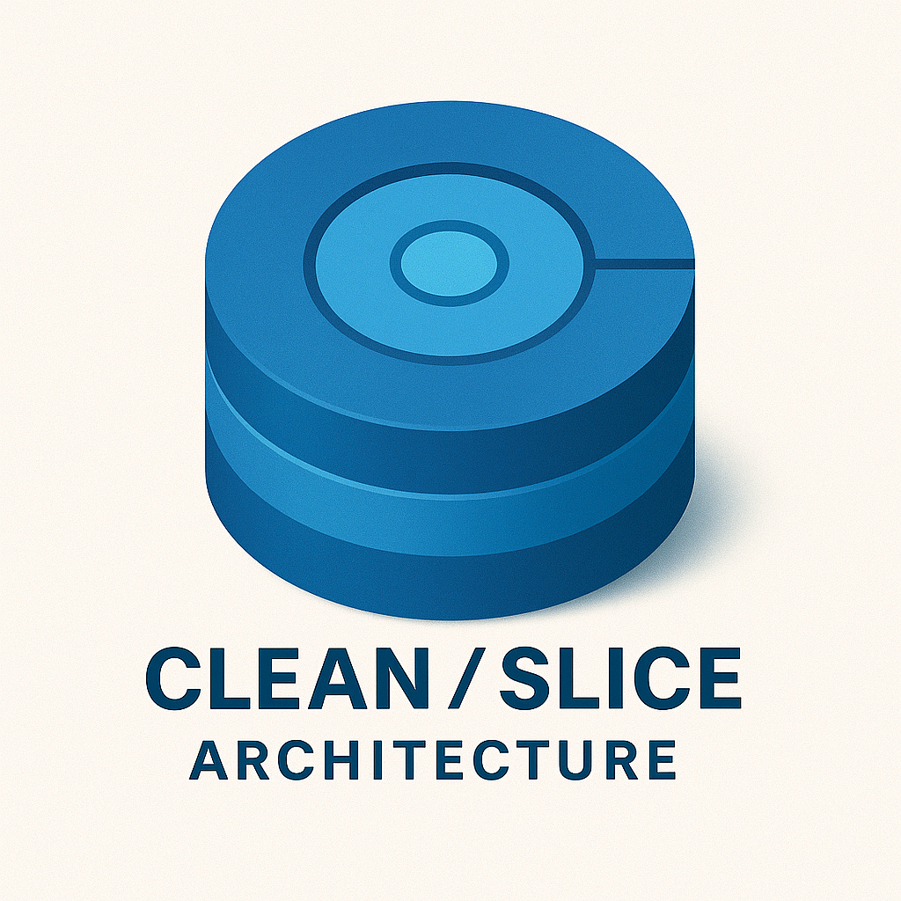
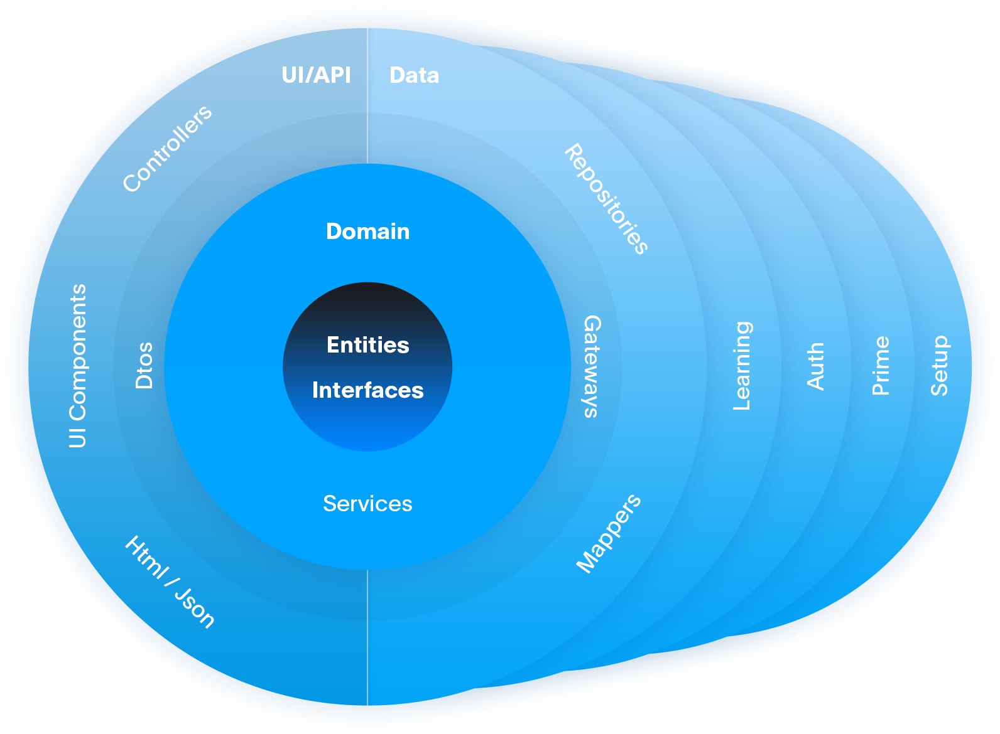

# Clean Slice

  

The Clean/Slice Architecture for building modern Agent-friendly applications.

### Contents

1. [App](./app/README.md)
2. [Api](./api/README.md)

### Tech stack

Clean Slice is an Opinionated framework that is built on the tech-stack:

#### Frontend

- Typescript, Scss
- Vite
- Vuejs
- Nuxtjs
- Vuetify

#### Backend:

- Nodejs, Typescript
- Nestjs
- OpenApi (Swagger, CodeGen)
- Prisma (DB ORM)
- PostgreSQL (DB)

#### Hosting

- AWS
- CloudFormation (in CDK ts)

#### Mobile app

- Capacitor

#### Testing

- vitest
- cucumber
- selenium
- cypress

## Core philosophy

- Screaming architecture
- Abstract when necessary
- Write reusable code
- Test more, debug less

Slice Architecture is the next step in Clean Architecture evolution. A slice is a feature limited to a folder inside the application.

# Theory

## Screaming architecture

"Screaming Architecture" is a term coined by Robert C. Martin, also known as Uncle Bob. The concept of Screaming Architecture is that the structure of a software application should clearly reflect its primary purpose and domain. When someone looks at the high-level structure of its source code, the purpose of the application should be immediately evident – it should "scream" its intent.

## Abstract when necessary

The "Abstract When Necessary" pattern is a software development principle that advises developers to introduce abstractions in their code only when it is necessary and justified, rather than prematurely. This principle is aligned with the broader philosophy of keeping code simple and maintainable, such as YAGNI Principle and Refactoring to Abstraction.

There are three recommended examples of structuring your app slice code.

1. [Repository (simple)](./app/slices/users/readme.md)
2. [Gateway](./app/slices/users-gateway/readme.md)
3. [Service](./app/slices/users-service/readme.md)

### Which pattern to start with?

Start by implementing the simple pattern if you are also developing the API. You can rapidly prototype your application without having to write lots of abstractions and can take advantage of the OpenAPI CodeGen feature ([Api slice](./slices/api/readme.md))

If you are not in control of the API, you can start with the Gateway pattern. This allows you to add a layer of abstraction on top of a Repository, that is often a third-party SDK.

## Write reusable code

The core principle of the Clean Slice Architecture is reusable features aka Slices. A slice is a loosely coupled implementation of a feature. It has its own readme and can only reference other slices through the slice key #sliceName.

This way a slice is independent and can be moved, shared or deleted without effecting the overall app. This approach allows the application to move away from being a monolithic app and become a feature-driven application.

## Test more, debug less

Testing is a big part of the Clean Slice Architecture. Ever Project has a test folder that sets ups a testing environment for:

- Unit testing (vitest)
- Integration testing (vitest, api mocks)
- End-to-end testing (cucumber, selenium, cypress)
