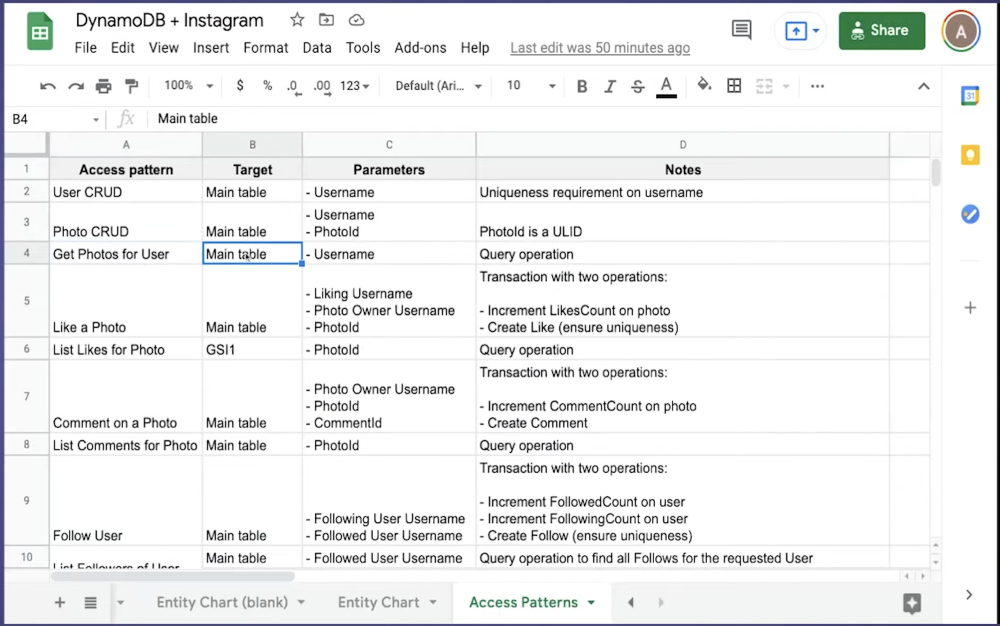
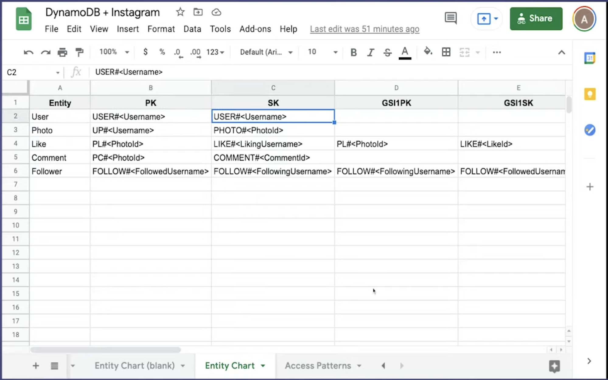

# Dynamo

### Install Dynamoose

run `npm i dynamoose`

add to `docker-compose.yml`

```yml
services:
  dynamodb-local:
  command: '-jar DynamoDBLocal.jar -sharedDb -dbPath ./data'
  image: 'amazon/dynamodb-local:latest'
  ports:
    - '8000:8000'
  volumes:
    - './docker/dynamodb:/home/dynamodblocal/data'
  working_dir: /home/dynamodblocal
```

### Best Practices

1. Have a terms and concepts of your Project

Example: `A USER can Register and Login to his Account`
Example: `A USER can LIKE an IMAGE`
Example: `A USER can upload an IMAGE to his FEED`
Example: `A USER can follow another USER one-way`
Example: `A USER can view all his FOLLOWERS`

2. List Access Patterns.

Example: `USER CRUD`
Example: `IMAGE CRUD`
Example: `GET IMAGE for USER`
Example: `Create COMMENT on an IMAGE`
Example: `FOLLOW USER`
Example: `LIST FOLLOWERS of USER`
Example: `LIST FOLLOWED by USER`



3. Naming your Partition key

First create an Entity check table



```js
[OBJECT]#[ID]
```

Example: `USER#691cc65e-8133-4748-b8b4-6b206a6c969b`
Example: `IMAGE#691cc65e-8133-4748-b8b4-6b206a6c969b`
Example: `FILE#691cc65e-8133-4748-b8b4-6b206a6c969b`
Example: `AGENT#691cc65e-8133-4748-b8b4-6b206a6c969b`
Example: `KNOWLEDGE#691cc65e-8133-4748-b8b4-6b206a6c969b`
